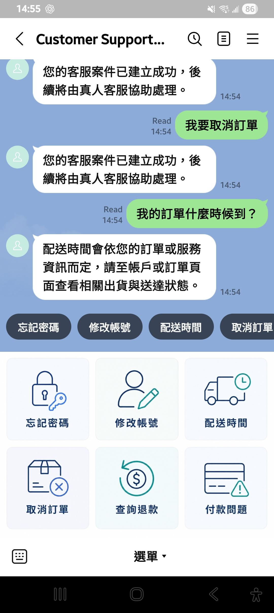
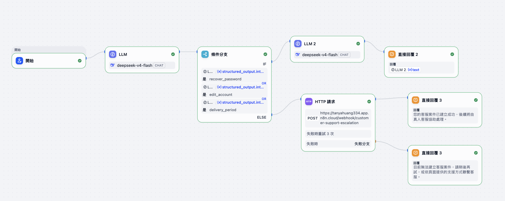
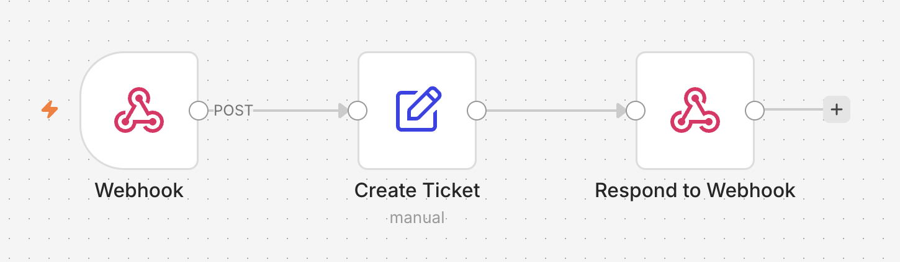
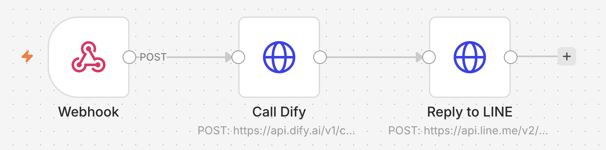

# AI Customer Support Escalation

以 **LINE Official Account + Dify + DeepSeek + n8n** 建立的 AI 客服與人工升級系統。

系統不讓 LLM 處理所有客服問題，而是將：

- 常見、低風險問題 → AI 回覆
- 付款、退款、取消訂單等問題 → Human Escalation
- 無法辨識的問題 → Human Escalation
- 常見問題 → LINE Rich Menu / Quick Reply

目標是降低 LLM 誤判與亂回答的風險，同時保留自然語言客服體驗。

---

## 專案目標

一般客服 Bot 常見兩個問題：

- Rule-based Bot 很穩定，但使用者只能按照固定流程操作
- LLM Bot 比較自然，但可能誤判 Intent、亂補政策或聲稱執行了實際不存在的操作

因此本專案採用 **Hybrid AI Customer Support Architecture**：

```text
LINE 使用者
    ↓
Rich Menu / 自由輸入
    ↓
n8n LINE Gateway
    ↓
Dify
    ↓
Intent Classification
    ↓
┌──────────────────┬──────────────────┐
│ AI Response      │ Human Escalation │
│                  │                  │
│ 忘記密碼         │ 取消訂單         │
│ 修改帳號         │ 查詢退款         │
│ 配送時間         │ 付款問題         │
│                  │ Unknown          │
└──────────────────┴──────────────────┘
```

核心設計原則：

> **LLM 負責理解與低風險回答，Workflow 負責重要的業務決策與人工升級。**

---

# Demo

## 1. LINE Customer Support Bot

> **圖片放置位置**
>
> 建議檔名：`images/line_customer_support_demo.jpg`



這張圖展示最終使用者操作介面。使用者可透過 **Rich Menu、Quick Reply 或自由輸入** 與 Bot 互動；低風險問題由 AI 回覆，需要人工處理的問題則會自動建立客服案件。

---

## 2. Dify Intent Routing Workflow

> **圖片放置位置**
>
> 建議檔名：`images/dify_workflow.png`



這張圖展示 Dify 的核心流程：先由 LLM 做 **Intent Classification**，再依 Intent 進行 **AI / Human Routing**。低風險問題交給第二個 LLM 產生回覆，高風險或 Unknown 問題則透過 HTTP Request 呼叫 n8n。

---

## 3. n8n Human Escalation Workflow

> **圖片放置位置**
>
> 建議檔名：`images/n8n_ticket_workflow.png`



這張圖展示人工升級流程。Dify 將需要人工處理的案件送到 n8n Webhook，n8n 建立結構化 Ticket，包含 `intent`、`priority`、`status` 與 `timestamp`，再將建立結果回傳給 Dify。

---

## 4. n8n LINE Gateway

> **圖片放置位置**
>
> 建議檔名：`images/n8n_line_gateway.png`



這張圖展示 LINE 與 Dify 之間的 API Gateway。n8n 接收 LINE Webhook 後呼叫 Dify API，再將 Dify 的最終結果透過 LINE Reply API 回傳給使用者。

---

# Intent Routing

目前支援 7 個分類結果：

| Intent | 範例 | Route |
|---|---|---|
| `recover_password` | 我忘記密碼 | AI |
| `edit_account` | 我要修改帳號資料 | AI |
| `delivery_period` | 我的訂單什麼時候到？ | AI |
| `cancel_order` | 我要取消訂單 | Human |
| `track_refund` | 我的退款在哪裡？ | Human |
| `payment_issue` | 我被扣款兩次 | Human |
| `unknown` | 你們有賣禮物卡嗎？ | Human |

### AI Route

目前只有三類問題交給 LLM 回覆：

```text
recover_password
edit_account
delivery_period
```

LLM Prompt 限制模型不得自行補充：

- 公司政策
- Payment Method
- Refund Timeline
- Verification Method
- 未提供的客服聯絡方式
- Backend Action
- 保證性承諾

### Human Escalation

以下類型直接轉人工：

```text
cancel_order
track_refund
payment_issue
unknown
```

例如：

```text
我被扣款兩次
    ↓
payment_issue
    ↓
Human Escalation
    ↓
priority = high
```

---

# Human Escalation with n8n

Dify 判定需要人工處理後，會透過 Webhook 呼叫 n8n。

n8n 建立結構化 Ticket：

```json
{
  "ticket_id": "TKT-...",
  "customer_query": "我被扣款兩次",
  "intent": "payment_issue",
  "status": "open",
  "priority": "high",
  "source": "dify",
  "timestamp": "..."
}
```

Priority Rule：

```text
payment_issue
→ high

其他 Human Escalation
→ medium
```

如果 Ticket Workflow 無法使用，系統不會直接顯示錯誤，而是回覆：

> 目前無法建立客服案件，請稍後再試，或依頁面提供的支援方式聯繫客服。

---

# LINE Integration

LINE 與 Dify 之間使用 n8n 作為 Gateway。

流程：

```text
LINE
 ↓
Webhook
 ↓
n8n
 ↓
Dify API
 ↓
AI / Human Workflow
 ↓
LINE Reply API
 ↓
使用者
```

目前支援：

- LINE Webhook
- Free-text Message
- Rich Menu
- Quick Reply
- Dify API
- LINE Reply API
- Human Escalation
- Failure Fallback

---

# Rich Menu

為降低 Intent Classification 錯誤，常見客服問題提供固定入口。

Rich Menu 包含：

```text
忘記密碼
修改帳號
配送時間
取消訂單
查詢退款
付款問題
```

使用者點擊後會送出預先定義的文字，例如：

```text
付款問題
    ↓
我有付款問題
    ↓
Dify
    ↓
payment_issue
    ↓
Human Escalation
```

因此整體 UX 為：

```text
常見問題
→ Rich Menu / Quick Reply

特殊問題
→ 自由輸入
→ LLM Intent Classification

高風險 / 無法辨識
→ Human Escalation
```

---

# Dataset

使用：

**Bitext Customer Support LLM Chatbot Training Dataset**

建立一份平衡的客服 Intent Dataset：

- 600 筆資料
- 6 個 Intent
- 每類 100 筆
- `random_state = 42`

使用的 Intent：

```text
recover_password
edit_account
delivery_period
cancel_order
track_refund
payment_issue
```

另外建立：

- 60 筆測試案例
- 每個 Intent 10 筆

---

# Functional Testing

完成 LINE End-to-End Manual Test。

| 測試輸入 | 預期結果 | 結果 |
|---|---|---|
| 我忘記密碼 | AI Response | ✅ PASS |
| 我要修改帳號資料 | AI Response | ✅ PASS |
| 我的訂單什麼時候到？ | AI Response | ✅ PASS |
| 我要取消訂單 | Human Escalation | ✅ PASS |
| 我的退款在哪裡？ | Human Escalation | ✅ PASS |
| 我被扣款兩次 | Human + High Priority | ✅ PASS |
| 你們有賣禮物卡嗎？ | Unknown → Human | ✅ PASS |
| 我有一個問題 | Unknown → Human | ✅ PASS |
| 我的 refund 還沒收到 | Refund → Human | ✅ PASS |
| Ticket Workflow 關閉 | Failure Fallback | ✅ PASS |

Integration Test：

```text
LINE → n8n                 ✅
n8n → Dify API             ✅
Dify Intent Routing        ✅
Dify → n8n Escalation      ✅
n8n Ticket Generation      ✅
n8n → LINE Reply API       ✅
Traditional Chinese Reply  ✅
Rich Menu                  ✅
Quick Reply                ✅
```

---

# Tech Stack

### AI / LLM

- DeepSeek
- Dify
- Structured Output
- Intent Classification
- Prompt Engineering

### Workflow Automation

- n8n
- Webhook
- HTTP Request
- Conditional Routing

### Messaging

- LINE Official Account
- LINE Messaging API
- Rich Menu
- Quick Reply

### Data

- Hugging Face
- Bitext Customer Support Dataset
- Python
- Pandas

---

# 主要設計考量

### 1. 不讓 LLM 控制所有流程

付款、退款、取消訂單等問題不讓 LLM 自行處理，而是交給 deterministic workflow。

### 2. Rich Menu 降低分類錯誤

常見問題直接讓使用者選擇，減少模糊輸入與 typo 對 Intent Classification 的影響。

### 3. 限制 Hallucination

LLM 只負責低風險 General Guidance，避免自行創造公司政策或不存在的 Backend Capability。

### 4. Human-in-the-loop

高風險或無法辨識的問題交由真人客服處理。

### 5. Failure Handling

外部 Workflow 發生問題時，提供 Controlled Fallback，而不是將 API Error 暴露給使用者。

---

# Limitations

目前為 Portfolio Prototype，尚未串接正式企業系統。

目前限制：

- Ticket 為模擬 Ticket Object
- 尚未串接 Zendesk / Salesforce / CRM
- 尚未建立 Ticket Database
- 沒有取得真實使用者帳號或訂單資料
- 沒有企業 Knowledge Base / RAG
- 尚未實作真人客服後續 Ticket Lifecycle

未來可擴充：

```text
CRM / Helpdesk Integration
RAG Knowledge Base
Customer Database
Conversation Memory
Ticket Database
Agent Notification
Monitoring & Analytics
```

---

# Key Takeaway

本專案不是單純將 LLM 接到 LINE，而是將：

**LINE + Dify + DeepSeek + n8n + Human Escalation**

組成一套 Hybrid AI Customer Support Workflow。

核心概念是：

> **LLM 負責語言理解與低風險回答，重要業務流程則由 deterministic workflow 與 Human-in-the-loop 控制。**
